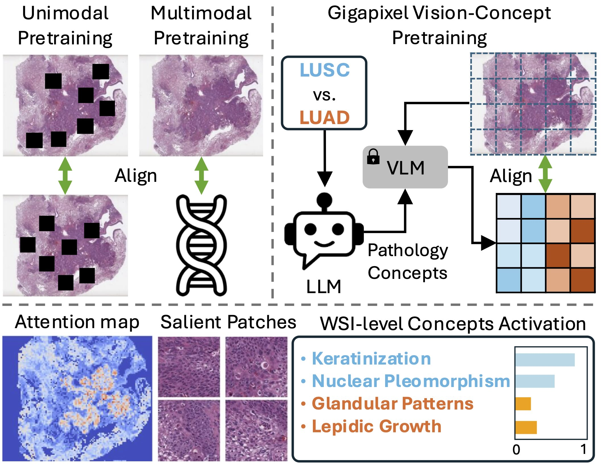

<h1>
  
  GECKO: Gigapixel Vision-Concept Contrastive Pretraining in Histopathology
</h1>


Official code for our work [GECKO: Gigapixel Vision-Concept Contrastive Pretraining in Histopathology](https://arxiv.org/abs/2504.01009)


## Requirements
To install python dependencies, 

```
conda create -n gecko python=3.9
conda activate gecko
conda install -c conda-forge openslide
pip install torch==2.2.2 torchvision==0.17.2 torchaudio==2.2.2 --index-url https://download.pytorch.org/whl/cu121
pip install openslide-python opencv-python scikit-image matplotlib pandas multiprocess tqdm transformers tokenizers scikit-learn numpy regex ftfy h5py timm==0.9.8

```

## Organizing Data

Detailed description for curating data for GECKO is provided in the directory [data_curation](https://github.com/bmi-imaginelab/GECKO/tree/main/data_curation). 


## Training

Following curating the data as explained above, we are now ready to feed the extracted Concept Prior and Deep features for pre-training dual-branch MIL using GECKO. 

Example training command:

```
features_dir="/your/lists_feats_dir"
experiment_dir="/your/experiment_dir"
split_path="/your/split_path_dir"

python train_gecko.py --keep_ratio 0.7 --top_k 10 --cross_val_fold 0 --dataset_dict_path "$features_dir/all_dict.pickle" --features_deep_path "$features_dir/deep_features.pth" --features_path "$features_dir/concept_prior.csv" --save_path "$experiment_dir" --split_path "$split_path" 
```

In train_gecko.sh and train_gecko_with_gene.sh bash file, we provide example to conduct cross-validation:

```
# chmod +x train_gecko.sh
# ./train_gecko.sh /your/lists_feats_dir /your/experiment_dir /your/split_path_dir


# chmod +x train_gecko_with_gene.sh
# ./train_gecko_with_gene.sh /your/lists_feats_dir /your/experiment_dir /your/split_path_dir /your/gene_exp_path
```

The Gene Expression data is provided here: [Data](https://drive.google.com/drive/folders/1AUcj53wuycHowVMFhPcZuYvw6GaXwfsr?usp=drive_link).

## Inference

After training the dual-branch MIL using GECKO, use the following notebook to explore unsupervised evaluation, supervised evaluation, and interpretability analysis. 

* **Notebook:** [evaluation.ipynb](./evaluation.ipynb)


## Acknowledgements

GECKO codebase builds heavily on [SI-MIL](https://github.com/bmi-imaginelab/SI-MIL), [TANGLE](https://github.com/mahmoodlab/TANGLE), [CONCH](https://github.com/mahmoodlab/CONCH), [ZoomMIL](https://github.com/histocartography/zoommil), [DSMIL](https://github.com/binli123/dsmil-wsi), and [CLAM](https://github.com/mahmoodlab/CLAM). We thank the authors for their contribution.

Reported research was partially supported by the National Institutes of Health (NIH) grants 1R01CA297843-01 and 3R21CA258493-02S1. The content is solely the responsibility of the authors and does not necessarily represent the official views of the NIH. 

## Reference

If you find our work useful in your research or if you use parts of this code please consider citing our [paper](https://arxiv.org/abs/2504.01009):

```
@article{kapse2025geckogigapixelvisionconceptcontrastive,
  title={GECKO: Gigapixel Vision-Concept Contrastive Pretraining in Histopathology},
  author={Kapse, Saarthak and Pati, Pushpak and Yellapragada, Srikar and Das, Srijan and Gupta, Rajarsi R and Saltz, Joel and Samaras, Dimitris and Prasanna, Prateek},
  journal={arXiv preprint arXiv:2504.01009},
  year={2025}
}
```
